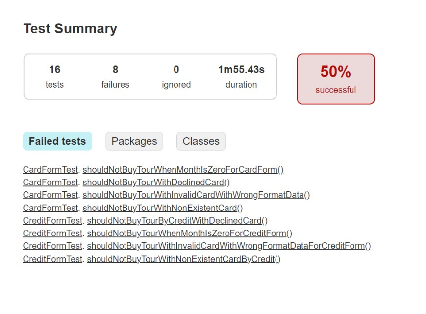
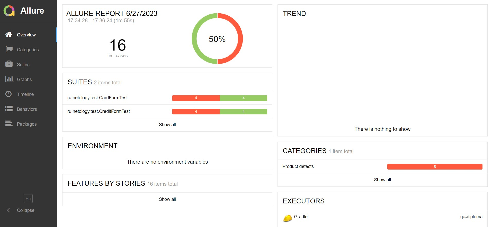

# Отчётные документы по итогам тестирования

## Краткое описание

Было выполнена автоматизация тестирования сервиса по покупке тура, взаимодействующего с СУБД и API Банка.

## Тест-кейсы
Всего было выполнено 16 автоматизированных тестов, из них:

- 8 тестов успешных, что составляет 50%;
- 8 тестов не прошли, что составляет 50%.

## Результаты выполнения автотестов:

**Отчет Gradle**

**Отчет Allure**

## Общие рекомендации

По результатам тестирования небходимо:
1. Добавить уникальные идентификаторы (test-id) элементам страницы для упрощения работы;
1. Исправить все найденные дефекты;
1. Кнопку "Продолжить" сделать активной только после того, как все поля будут корректно заполнены;
1. Доработать тестовую документацию. 